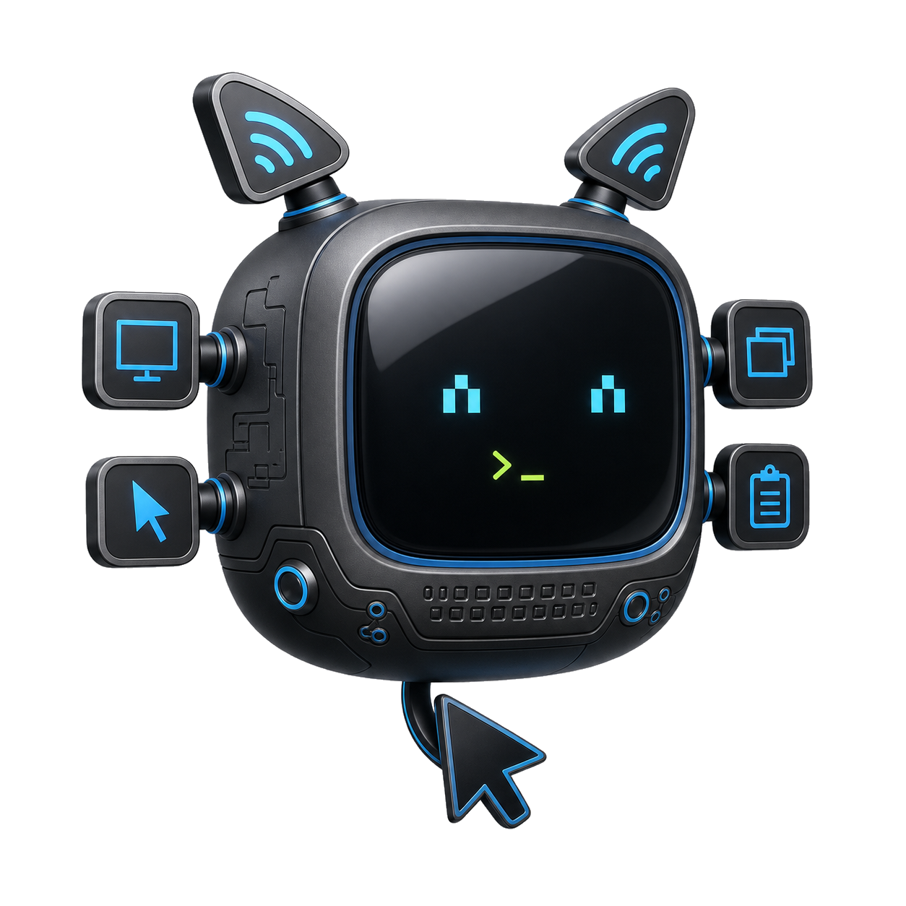
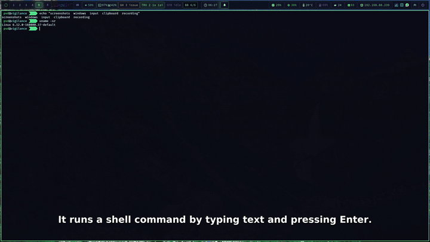

# computer-use-sway

<p align="center">
  
</p>

`computer-use-sway` is a local MCP stdio server that lets an MCP client inspect and operate the current Sway desktop session.

It exposes screen, window, pointer, keyboard, clipboard, and recording tools through Sway-native commands. It is designed for Linux desktops running Sway on Wayland.

## Demo

A 61-second narrated tour, produced by this server itself: the screen shows
`computer-use-sway` driving a live terminal — moving the pointer, typing
commands, round-tripping the clipboard, and scrolling — while the narration is
anchored to the recording timeline, synthesized, and mixed over the video with
the spoken words rendered as burned-in captions.



Full narrated video (the server's native MP4/H.264 output):

- [computer-use-sway-demo.mp4](assets/computer-use-sway-demo.mp4) — plays in browsers, on Apple hardware, and on X/Twitter

## Capabilities

- Inspect active outputs, seats, focused windows, and required binaries.
- Capture screenshots as MCP image content or data URLs.
- Return a simplified Sway window tree.
- Focus windows by container ID, app ID, class, or title.
- Move the pointer, click, drag, and scroll.
- Type text and send key chords through `wtype`.
- Read and write text clipboard contents through `wl-clipboard`.
- Record a screen region as a silent web-ready video or constrained GIF.
- Capture a monotonic event timeline during recording and optionally attach a
  scripted, timeline-aligned voiceover track.

## Requirements

Runtime commands:

- `swaymsg`
- `grim`
- `wtype`
- `wl-copy`
- `wl-paste`
- `wf-recorder` (recording)
- `ffmpeg` and `ffprobe` (recording)

Optional, only for narration and fallback anchors (runtime-detected; missing
commands produce a clear tool error and never a hard import failure):

- `edge-tts` — text-to-speech (keyless, but unofficial and network-dependent;
  the default engine. Narration text is sent to Microsoft.)
- `piper` — offline text-to-speech that never leaves the host; needs a voice
  model file (pass `voice` or set `COMPUTER_USE_SWAY_PIPER_MODEL`)
- `tesseract` — OCR for `recording_scenes` keyframe text (optional)

On openSUSE:

```bash
sudo zypper in python3 sway grim wtype wl-clipboard wf-recorder ffmpeg
```

On Debian or Ubuntu:

```bash
sudo apt install python3 sway grim wtype wl-clipboard wf-recorder ffmpeg
```

Non-recording tools work without the recording binaries; recording tools fail with a clear error until they are installed.

To enable narration and OCR on openSUSE, install the optional tools separately.
`edge-tts` is a Python application rather than a distro package, so install it
with `pipx`, which the distribution does package:

```bash
sudo zypper in python313-pipx tesseract-ocr
pipx install edge-tts
```

`pipx` places the `edge-tts` console script in `~/.local/bin`, which the server
already searches. `piper` has no openSUSE package: install the upstream binary
and a voice model, then set `COMPUTER_USE_SWAY_PIPER_MODEL` to the model path if
you need narration that never leaves the host.

## Install

From a checkout:

```bash
python3 -m pip install .
```

For editable development:

```bash
python3 -m pip install -e .
```

## Register With Codex

After installation:

```bash
computer-use-sway --install-codex-mcp
```

That registers a stdio MCP server named `computer-use-sway`.

If the command is not on `PATH`, set the exact command Codex should launch:

```bash
COMPUTER_USE_SWAY_COMMAND="/path/to/venv/bin/computer-use-sway" computer-use-sway --install-codex-mcp
```

Verify:

```bash
computer-use-sway --self-test
codex mcp list
```

Remove the Codex registration:

```bash
computer-use-sway --uninstall-codex-mcp
```

## Run As MCP Server

Most clients should launch the command directly over stdio:

```bash
computer-use-sway
```

During source checkout development, this also works:

```bash
PYTHONPATH=src python3 -m computer_use_sway
```

## Recording

Recording is a three-step lifecycle designed for autonomous agents:

1. `recording_start` — begin capture of one output (or a region inside it).
2. `recording_stop` — stop capture and begin finalization.
3. `recording_status` — poll until the phase is `completed` or `failed`.

`recording_start` accepts `output` (inferred when exactly one output is active), an
optional `region` fully contained in that output, `format`, and
`max_duration_seconds`. Only one recording may be active at a time.

A typical exchange, as an MCP client would issue it:

```json
{"name": "recording_start", "arguments": {"output": "DP-1", "format": "mp4", "max_duration_seconds": 30}}
{"name": "recording_stop",  "arguments": {}}
{"name": "recording_status", "arguments": {}}
```

`recording_status` answers with the current phase while working and, once
`completed`, the artifact's absolute path, codec, dimensions, duration, and byte
size — everything needed to publish the demo without inspecting the file.

Formats:

- `mp4` (default): silent H.264 video in MP4 at 30 fps, `yuv420p`, `+faststart`.
  Plays everywhere, including browsers, Apple hardware, and X/Twitter. This is
  the recommended, widest-compatibility output.
- `webm`: silent AV1 video in WebM at 30 fps, periodic keyframes for seeking,
  smaller files. AV1 is not decodable on some older Apple hardware and WebM is
  not accepted by X/Twitter, so prefer `mp4` unless you specifically want AV1.
- `gif`: deliberately constrained fallback for contexts that cannot run
  `<video>` (some email and chat clients). Maximum 15 seconds, 12 fps, 960 px
  maximum width, infinite loop. A GIF of the same content is far larger.

All formats are silent by default; there is no audio parameter on
`recording_start`. Narration is a separate, opt-in step and inherits the
recording's container.

Behavior and limits:

- The pointer cursor is always included in recordings.
- Capture goes to a lossless Matroska intermediate first; the requested artifact
  is produced after stop, so `recording_stop` returns quickly and finalization
  is observed through `recording_status` (`recording` → `stopping` →
  `processing` → `completed`/`failed`).
- Recordings are written to
  `$XDG_RUNTIME_DIR/computer-use-sway/recordings` with `0700`/`0600`
  permissions. That directory is runtime storage: files do not survive logout
  or reboot, so move or upload finished artifacts promptly.
- Recordings stop automatically at `max_duration_seconds` (default 60 for
  `mp4` and `webm`, 15 for `gif`) or when the intermediate exceeds 1 GiB.
- If finalization fails, the intermediate `.mkv` and a `.log` with the tool's
  stderr are kept and reported so the material is recoverable.

### Timeline

While capture runs, every action and observation tool call (`screen_info`,
`screenshot`, `window_tree`, `focus_window`, `move_pointer`, `click`, `drag`,
`scroll`, `type_text`, `key`, `clipboard_set`, `clipboard_get`) is appended to a
monotonic, recording-relative timeline with a curated payload. The payload
records coordinates, buttons, counts, key names, window identifiers, and byte or
character counts — never typed text or clipboard contents, and never screenshot
image data, so the timeline is safe to store and share.

- `recording_timeline` returns the events (`id`, `t_ms`, `tool`, `ok`,
  `payload`) for the current or last recording.
- On completion a `0600` sidecar JSON copy is written next to the artifact as
  `<id>.timeline.json` and reported as `timeline_path`; its event ids are the
  anchors narration uses.
- `t_ms` is measured from the start of the recording. The recorder's first frame
  lands a few milliseconds later (process launch and encoder latency); that skew
  is constant for a take and can be compensated with the `offset_ms` narration
  option.

### Scripted voiceover

Narration is strictly opt-in: recordings are silent unless you explicitly ask
the agent for a voiceover, narration, or an explainer with audio. When you do,
`recording_voiceover` is the one place audio enters the pipeline. The calling
agent writes the prose; the server validates it, synthesizes speech, aligns it
to the timeline, and muxes it. Use `recording_timeline` first to pick anchors.

```json
{"name": "recording_voiceover", "arguments": {
  "engine": "edge",
  "voice": "en-US-AriaNeural",
  "fit": "natural",
  "segments": [
    {"anchor": {"event_id": 1}, "text": "First I open the settings panel."},
    {"anchor": {"at_ms": 4200}, "text": "The score improves as the solver runs."}
  ]
}}
```

- Each segment has exactly one anchor: `event_id` (an id from the timeline) or
  `at_ms` (absolute milliseconds into the recording). Anchors position the first
  spoken word of the segment.
- `engine` is `auto` (default), `edge`, or `piper`. `auto` prefers `edge-tts`,
  then `piper`; if neither is installed it fails with a clear error instead of
  substituting something else.
- `offset_ms` (±5000) shifts every anchor to compensate for recorder skew.
- `fit` is `natural` (default: later segments are pushed forward so they never
  overlap, preserving natural speech) or `compress` (a segment that would
  overrun the next anchor is time-compressed with `atempo`).
- `tail_ms` (default 300) extends the audio track past the last word.
- `subtitles` (default `true`) burns styled captions of the narration into the
  video, synced to each segment. Because captions are drawn into the frame, this
  re-encodes the video with the same video encoder (H.264 for MP4, AV1 for
  WebM); set `subtitles: false` to keep the stream-copy path and produce a
  caption-free video.
- Narration starts an asynchronous `narrating` phase; poll `recording_status`
  until `completed`. On success the result gains `audio_included: true` and a
  `narration` block with per-segment `start_ms`, `duration_ms`, `shift_ms`,
  `compressed`, and `word_count`. On failure the recording reverts to
  `completed` with `narration.error`.
- With subtitles disabled the video stream is copied, never re-encoded
  (`-c:v copy`); the added track is AAC for MP4 or Opus for WebM. The artifact
  path is unchanged.
- **GIF cannot carry audio.** `recording_voiceover` refuses `format=gif` and
  tells you to record `mp4` or `webm`.

### Fallback anchors

`recording_scenes` runs cheap, keyless enrichment on a completed recording:
`ffmpeg` scene-cut timestamps, with optional keyframe OCR via `tesseract`
(`ocr: true`). These are approximate and deliberately secondary — use them only
when no timeline exists, never as the sync source.

## Agent Guidance

MCP tool schemas describe arguments but not how to operate a desktop well. This
server therefore ships its operating procedure in two forms:

- **Protocol-native**: the `initialize` response includes MCP `instructions`
  covering coordinate derivation, verify-after-action discipline, untrusted
  on-screen text, the recording lifecycle, and confirmation before destructive
  actions. Every MCP client receives these automatically.
- **Optional skill for opencode**: a richer procedural guide lives in
  `skill/solverforge-computer-use/SKILL.md` in this repository. To install it
  for opencode, copy the directory:

  ```bash
  mkdir -p ~/.config/opencode/skill
  cp -r skill/solverforge-computer-use ~/.config/opencode/skill/
  ```

  The repository copy is the source of truth; keep installed copies in sync
  with it.

## Diagnostics

```bash
computer-use-sway --doctor
```

The server reconstructs `XDG_RUNTIME_DIR`, `SWAYSOCK`, and `WAYLAND_DISPLAY` from `/run/user/<uid>` when an MCP host launches it with a sanitized environment.

## Security

This server gives an MCP client practical control over your active desktop session. Only register it with local clients you trust. It intentionally has no network listener; the transport is stdio.

Recording captures whatever is visible on the recorded output, including the pointer cursor, until it is stopped. Recordings are written only to the server's private runtime directory, and their paths are returned to the MCP client; treat any active recording as visible desktop observation.

Narration is the only feature that can send data off the host. The default text-to-speech engine, `edge-tts`, transmits the narration prose you submit to Microsoft's Edge Read Aloud endpoint; it is keyless but unofficial, network-dependent, and ToS-gray. If narration text must not leave the host, use `engine: "piper"`, which runs fully offline (and install a voice model), or do not call `recording_voiceover` at all. The server never generates prose and never falls back to a network engine silently.

## Documentation

- `WIREFRAME.md`: the shipped MCP tool surface and runtime contract.
- `docs/architecture.md`: module layout, boundaries, and lifecycle.
- `AGENTS.md`: repository rules, including the 500-line file limit.
- `skill/solverforge-computer-use/SKILL.md`: the agent operating procedure.

## Development

```bash
make check
```

`make check` runs the unit tests, Python bytecode compilation, and the file
length check. It does not require an active Sway session. The server is split
into focused modules under `src/computer_use_sway/`; any file that reaches 500
lines must be split (`scripts/check_file_length.py`).

Build local distribution artifacts:

```bash
python3 -m pip install ".[publish]"
make build
```

## License

`computer-use-sway` is released under the MIT License. See [LICENSE](LICENSE).
