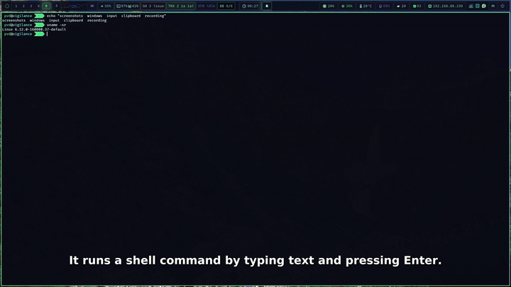

# computer-use-sway

<p align="center">
  
</p>

`computer-use-sway` is a local MCP stdio server that lets an MCP client inspect and operate the current Sway desktop session.

It exposes screen, window, pointer, keyboard and clipboard tools through Sway-native commands. It is designed for Linux desktops running Sway on Wayland.

## Demo

A 61-second narrated tour, produced by these two tools together: the screen shows
`computer-use-sway` driving a live terminal — moving the pointer, typing
commands, round-tripping the clipboard, and scrolling — while `seshat` recorded
the take and mixed a narration anchored to the timeline this server published,
with the spoken words rendered as burned-in captions.



Full narrated video:

- [computer-use-sway-demo.mp4](assets/computer-use-sway-demo.mp4) — plays in browsers, on Apple hardware, and on X/Twitter

## Capabilities

- Inspect active outputs, seats, focused windows, and required binaries.
- Capture screenshots as MCP image content, data URLs, or a private file on
  disk (`save_path`) for flat image budgets.
- Return a simplified Sway window tree.
- Focus windows by container ID, app ID, class, or title.
- Move the pointer, click, drag, and scroll.
- Type text and send key chords through `wtype`.
- Read and write text clipboard contents through `wl-clipboard`.
- Publish every dispatched action to the take timeline stream a recorder reads.

## Screenshots and image budgets

`screenshot` captures the current output or a rectangular region as PNG. By
default it returns the PNG as MCP image content (or a data URL when `output` is
set). MCP hosts that cap the number of images per request become unusable after
a few dozen screenshots; to keep the image budget flat, pass `save_path`:

```json
{"name": "screenshot", "arguments": {"save_path": "/run/user/1000/shots/step-01.png"}}
```

`save_path` writes the PNG to that exact path (mode `0600`; the parent directory
must exist) and returns the same text metadata (`bytes`, `dimensions`, `region`,
`include_cursor`, plus `saved_to`) with no image block, so a long automation run
can keep capturing indefinitely. Inspect the saved files with local tooling
(for example `tesseract` for OCR) instead of routing image bytes back through
the MCP host. `save_path` and `output` are mutually exclusive.

## Requirements

Runtime commands, all of them desktop tooling:

- `swaymsg` (Sway IPC)
- `grim` (screenshots)
- `wtype` (text and key events)
- `wl-copy` and `wl-paste` (clipboard)

Python 3.10 or newer, standard library only: `dependencies = []` is a hard
contract. The recording stack (`wf-recorder`, `ffmpeg`, `ffprobe`, TTS engines,
`tesseract`) is not a dependency of this server any more — it belongs to `seshat`.

## Install

From a checkout:

```bash
python3 -m pip install .
```

For editable development:

```bash
python3 -m pip install -e .
```

## Register With Codex

After installation:

```bash
computer-use-sway --install-codex-mcp
```

That registers a stdio MCP server named `computer-use-sway`.

If the command is not on `PATH`, set the exact command Codex should launch:

```bash
COMPUTER_USE_SWAY_COMMAND="/path/to/venv/bin/computer-use-sway" computer-use-sway --install-codex-mcp
```

Verify:

```bash
computer-use-sway --self-test
codex mcp list
```

Remove the Codex registration:

```bash
computer-use-sway --uninstall-codex-mcp
```

## Run As MCP Server

Most clients should launch the command directly over stdio:

```bash
computer-use-sway
```

During source checkout development, this also works:

```bash
PYTHONPATH=src python3 -m computer_use_sway
```

## Recording and narration (moved)

Screen recording, the take timeline, speech synthesis, captions and muxing now
live in a separate MCP server, **`seshat`** (<https://github.com/blackopsrepl/seshat>).
This server publishes every action it dispatches to that server's timeline stream
(`$XDG_RUNTIME_DIR/seshat/streams/computer-use-sway.jsonl`), which is what makes a
take of this desktop narratable. The contract, the tool surface and the workflows
are documented in that repository's README and WIREFRAME.

## Agent Guidance

MCP tool schemas describe arguments but not how to operate a desktop well. This
server therefore ships its operating procedure in two forms:

- **Protocol-native**: the `initialize` response includes MCP `instructions`
  covering coordinate derivation, verify-after-action discipline, untrusted
  on-screen text, and confirmation before destructive actions. Every MCP client
  receives these automatically.
- **Optional skill for opencode**: a richer procedural guide lives in
  `skill/solverforge-computer-use/SKILL.md` in this repository. To install it
  for opencode, copy the directory:

  ```bash
  mkdir -p ~/.config/opencode/skill
  cp -r skill/solverforge-computer-use ~/.config/opencode/skill/
  ```

  The repository copy is the source of truth; keep installed copies in sync
  with it.

## Diagnostics

```bash
computer-use-sway --doctor
```

The server reconstructs `XDG_RUNTIME_DIR`, `SWAYSOCK`, and `WAYLAND_DISPLAY` from `/run/user/<uid>` when an MCP host launches it with a sanitized environment.

## Security

This server gives an MCP client practical control over your active desktop session. Only register it with local clients you trust. It intentionally has no network listener; the transport is stdio.

This server publishes what it dispatches, including to the take timeline stream at
`$XDG_RUNTIME_DIR/seshat/streams/computer-use-sway.jsonl`. Payloads are curated
here before they are written — typed text becomes a character count and clipboard
content a byte count, never the content itself — so the stream is safe to keep.
Any recorder that ingests it decides when and how those actions are narrated.

## Documentation

- `WIREFRAME.md`: the shipped MCP tool surface and runtime contract.
- `docs/architecture.md`: module layout, boundaries, and lifecycle.
- `AGENTS.md`: repository rules, including the 500-line file limit.
- `skill/solverforge-computer-use/SKILL.md`: the agent operating procedure.

## Development

```bash
make check
```

`make check` runs the unit tests, Python bytecode compilation, and the file
length check. It does not require an active Sway session. The server is split
into focused modules under `src/computer_use_sway/`; any file that reaches 500
lines must be split (`scripts/check_file_length.py`).

Build local distribution artifacts:

```bash
python3 -m pip install ".[publish]"
make build
```

## License

`computer-use-sway` is released under the MIT License. See [LICENSE](LICENSE).
